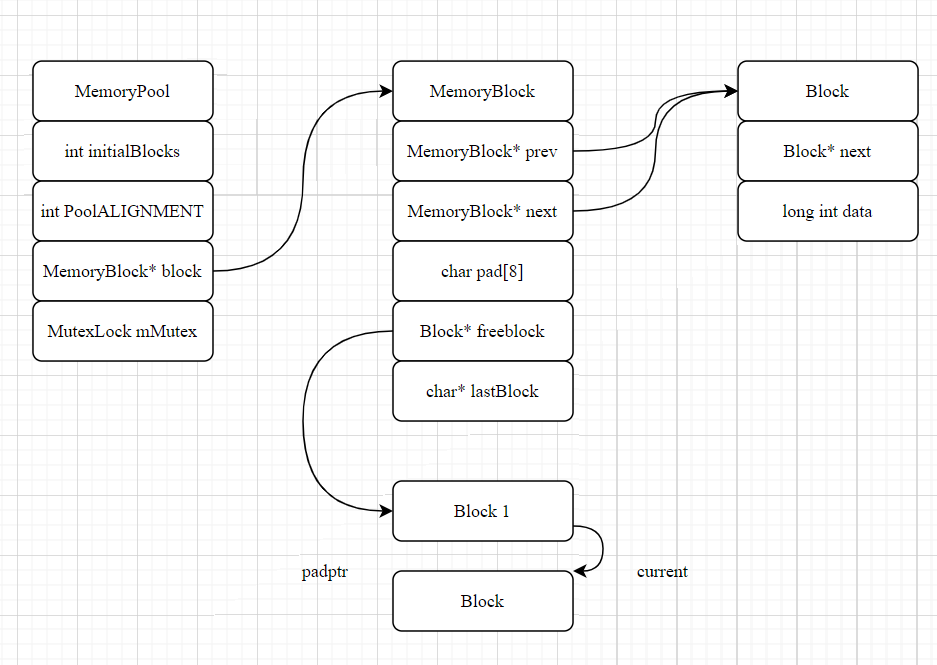

# MemPoolforWebserver

一个用于webserver中httpdata类的内存池

根据`HttpData`大小划定n个大小相同（目前只考虑管理对一个对象进行内存管理，所以每块大小为固定值：`sizeof(HttpData)`）block进行集中管理

重载`HttpData`的`new `与`delete`

* `new`直接在`class HttpData`中重载
* 因为使用`shared_ptr`实现`HttpData`，所以`delete`的重载需按照shared_ptr自定义`delete`函数的形式
  * `std::shared_ptr(new HttpData(), deleter);`

* 下一步工作中需采用多线程/进程，所以对于MemPool的Alloc和Dealloc加上mutex 

### 下一步工作

目前暂未实现空闲内存的释放，内存申请之后就一直维护在内存池中